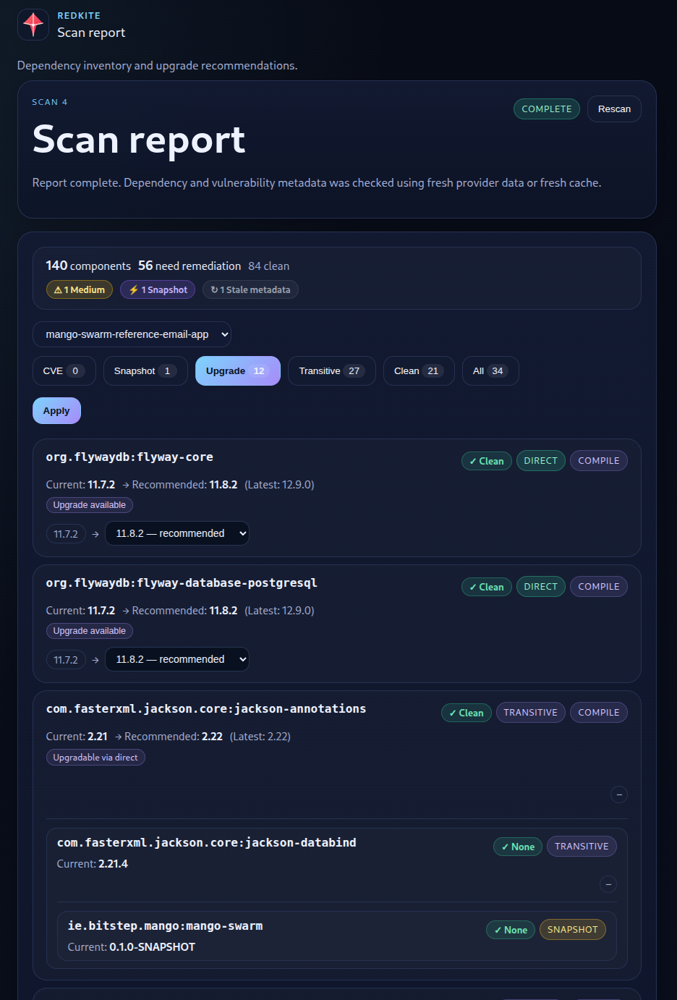

# RedKite

RedKite is a local Maven dependency scanner and upgrade assistant for checked-out Java repositories.

It scans local working copies, builds a dependency inventory, checks Maven Central for newer versions, records vulnerability findings from OSV.dev, and lets you select upgrades in the browser and copy a ready-to-paste updated POM.



## What It Does

- scans Maven multi-module projects (dependencies, dependency management, and build plugins)
- shows direct and transitive dependencies with scope and version source
- highlights SNAPSHOT dependencies as unverified risks
- fetches and caches version metadata from Maven Central
- fetches and caches vulnerability data from OSV.dev
- recommends upgrades grouped by module with per-component version selectors
- generates an updated POM preview in-browser — copy and paste it into the file on disk
- keeps all data on the developer machine

## Requirements

- Java 17 or later ([download](https://adoptium.net))
- Maven 3.9+ (must be on `PATH` for dependency tree resolution)

## Install

Download the latest `red-kite-<version>.zip` from the [releases page](../../releases), then unzip it:

```bash
unzip red-kite-<version>.zip -d red-kite
cd red-kite
```

## Start The Server

```bash
./red-kite.sh
```

On Windows:

```bat
red-kite.bat
```

The server starts on port `6502` and stores its database in a `data/` subdirectory next to the JAR. Open the UI at:

```
http://localhost:6502
```

## Scan A Repository

On the home page, type the full path to a Maven project and click **Scan**. A progress overlay shows while the scan runs; the browser navigates to the scan report when complete.

You can also click the **Scan** button next to any previously-scanned project, or **Rescan** from inside a scan report.

## Apply Upgrades

In the scan report, use the module dropdown to select a POM, adjust target versions in the dropdowns, and click **Apply**. A popup shows the updated POM XML. Click **Copy** and paste it into the file on disk.

## Configuration

Pass JVM system properties to override defaults:

```bash
java -Dredkite.port=8080 -jar red-kite.jar
```

| Property | Default |
|---|---|
| `redkite.port` | `6502` |
| `redkite.db.url` | `jdbc:h2:./data/redkite;MODE=PostgreSQL;DATABASE_TO_LOWER=TRUE` |
| `redkite.db.user` | `sa` |
| `redkite.db.password` | _(empty)_ |

## Build From Source

Requires Maven 3.9+ and Java 17.

```bash
mvn package -DskipTests
```

The fat JAR is produced at `red-kite-server/target/red-kite-<version>.jar`.

## Known Limitations

- Maven projects only.
- Local repositories only.
- No Gradle, npm, Docker, or license scanning.
