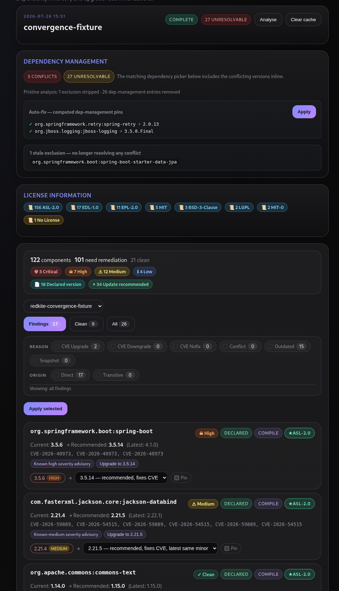

# RedKite

RedKite is a local Maven dependency analyser and upgrade assistant.

It analyses a Maven project, builds a dependency inventory, checks Maven Central for newer versions, records vulnerability findings from OSV.dev, and lets you select upgrades in the browser and generate a ready-to-apply updated POM.



📖 [Documentation](https://johnjoeallen.github.io/redkite/) — start with the [Quick Start guide](https://johnjoeallen.github.io/redkite/quick-start).

## What It Does

- analyses Maven multi-module projects (dependencies, dependency management, and build plugins)
- shows declared (direct) and transitive dependencies with scope and version source
- highlights SNAPSHOT dependencies as unverified risks
- fetches and caches version metadata from Maven Central
- fetches and caches vulnerability data from OSV.dev
- recommends upgrades grouped by module with per-component version selectors
- resolves known CVEs in three tiers — an upgrade that clears the vulnerability, a downgrade below where it was introduced if no upgrade fixes it, or a best-effort suggestion at the lowest achievable severity if neither fully resolves it — each verified live so the suggested version doesn't carry an unrelated CVE of its own
- applies selected upgrades directly to the POMs on disk, validating the build before and after
- keeps all data on the developer machine

## Requirements

- Java 17 or later ([download](https://adoptium.net))
- Maven 3.9+ (must be on `PATH` for dependency tree resolution)

## Install

Download the latest `red-kite-<version>.zip` from the [releases page](../../releases), then unzip it:

```bash
unzip red-kite-<version>.zip -d red-kite
cd red-kite
```

## Start The Server

```bash
./red-kite.sh
```

On Windows:

```bat
red-kite.bat
```

The server starts on port `6502` and stores its database in a `data/` subdirectory next to the JAR. Open the UI at:

```
http://localhost:6502
```

## Analyse A Repository

On the home page, type the full path to a Maven project and click **Analyse**. A progress overlay shows while the analysis runs; the browser navigates to the analysis when complete.

You can also click the **Analyse** button next to any previously-analysed project on the home page, or **Analyse** from inside an existing analysis.

## Project Page

Each project has a page showing:

- a summary of the latest analysis (component count, recommendations, status)
- an **Analysis history** list of all past analyses with timestamps and status badges — click any row to open that analysis
- an **Analyse** button to trigger a new analysis
- the resolved `settings.xml` path and configured Maven repositories

## Apply Upgrades

In the analysis, adjust target versions in the dropdowns and click **Apply selected**. RedKite runs a bracketed validation sequence:

1. Builds the project in its current state (`mvn clean install -DskipTests`)
2. Writes all POM changes to disk
3. Builds again to confirm the changes produce a working build

A progress overlay shows the current phase. If post-apply validation fails, RedKite reverts all POM changes and reports the failure with the attributed dependency where possible. If the project was already failing before apply, that is noted and the revert logic still runs. Once apply succeeds, RedKite automatically triggers a fresh analysis of the project so you can see whether any further fixes are needed.

General upgrades stay property-backed: any literal `<version>` tag is normalized to a `${artifactId.version}` property reference, and RedKite updates the property value to the chosen version. Dependency-management is reserved for conflict fixes and transitive overrides, and those pins always use an explicit, hardcoded version number rather than a `${...}` property reference.

Apply conflict fixes (dependency-management pins and exclusions) before applying general upgrades. Conflicts pin a dependency to a specific resolved version across modules, so applying an unrelated upgrade first can shift what "resolved" means and invalidate the conflict fix, forcing you to re-check convergence after the fact.

Use **Clear cache** to flush the cached version and vulnerability metadata and force a fresh fetch on the next analysis.

## Configuration

Pass JVM system properties to override defaults:

```bash
java -Dredkite.port=8080 -jar red-kite.jar
```

| Property | Default |
|---|---|
| `redkite.port` | `6502` |
| `redkite.db.url` | `jdbc:h2:~/.redkite/redkite;MODE=PostgreSQL;DATABASE_TO_LOWER=TRUE` |
| `redkite.db.user` | `sa` |
| `redkite.db.password` | _(empty)_ |
| `redkite.prefs.file` | `~/.redkite/preferences.properties` |
| `redkite.osv.url` | `https://api.osv.dev` |
| `redkite.version.lookback` | `10` — how many older releases the version-selector dropdown offers below the current version |

### Build Validation Settings

Some projects need a Spring profile or other environment-specific config to build or start (e.g. for the `spring-boot:run` startup check). These are per-project, not global, since different projects can need different values — set them on the **Build validation** panel on each project's page (`/projects/{id}`):

- **Extra mvn arguments** — whitespace-separated arguments appended to every validation `mvn` call (build and `spring-boot:run`), e.g. `-Pdev -Dspring.profiles.active=dev`
- **Extra environment variables** — comma-separated `KEY=VALUE` pairs set on the spawned validation processes, e.g. `SPRING_PROFILES_ACTIVE=dev,DB_HOST=localhost`

Stored in the database (`projects.validation_maven_args` / `projects.validation_env`) and applied to the next apply — no restart needed.

### Config Page

The gear icon in the top nav opens `/config`, where the vulnerability and version metadata cache TTLs can be changed at runtime (stored in the database, seeded from the compiled-in defaults on first run) — presets from 15 minutes to 1 day. Changes apply to the next lookup; no restart needed.

## Build From Source

Requires Maven 3.9+ and Java 17.

```bash
mvn package -DskipTests
```

The fat JAR is produced at `red-kite-server/target/red-kite-<version>.jar`.

## Known Limitations

- Maven projects only.
- Local repositories only.
- No Gradle, npm, Docker, or license scanning.
