# RedKite Assist — Dependency Remediation Model
RedKite Assist is a local Maven dependency analysis and remediation assistant. It compares Maven dependency models, validates the current project, lets the user choose a remediation strategy, applies changes safely, validates the result, and records outcomes.
It is not a black-box upgrader. It separates facts, intent, changes, validation, and history.
```text
Models tell the truth.
Unmodified validation proves the starting point.
Strategies express intent.
Plans make changes.
Validation proves them.
History prevents repeated mistakes.
```
---
## 1. Core Flow
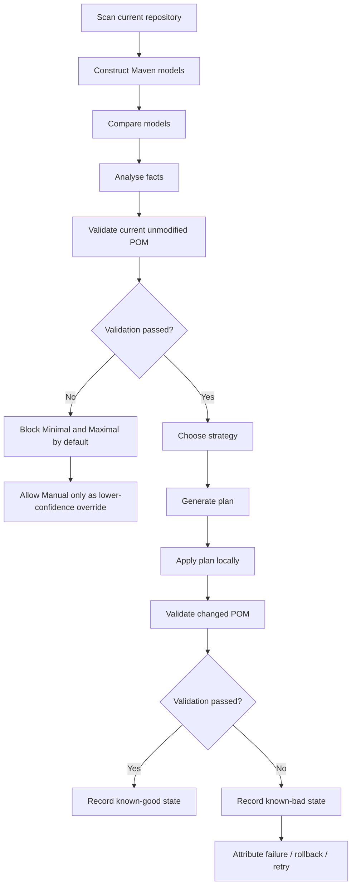
---
## 2. Architecture
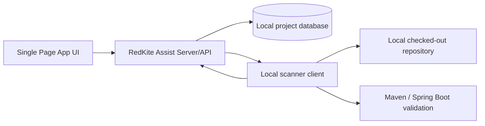
| Component | Responsibility |
|---|---|
| SPA UI | Shows projects, analysis, model comparison, validation, strategy selection, plans, warnings, progress, and history. |
| Server/API | Stores local scan history, compares Maven models, generates plans, records attempts and outcomes. |
| Scanner | Scans local repositories, computes fingerprints, creates branches, edits POMs, runs Maven/startup validation, collects logs. |
---
## 3. Key Rules
1. **Analysis does not choose the upgrade path.**
2. **The current unmodified POM must build and validate during analysis.**
3. **Minimal and Maximal stay within the same major version.**
4. **Only Manual may cross major versions.**
5. **RedKite must distinguish project-owned controls from RedKite-originated controls.**
6. **Injected transitive overrides must not hide natural Maven resolution.**
7. **No hardcoded dependency-family knowledge.**
8. **Every applied plan must be validated before it becomes known-good.**
---
## 4. Maven Models
RedKite compares four Maven resolution models.
| Model | Purpose |
|---|---|
| **Pristine model** | Shows what Maven would resolve without RedKite-originated controls, even if those controls were later accepted by the user. |
| **Clean accepted baseline** | Shows the accepted project state, excluding unaccepted RedKite-pinned changes. |
| **In-place model** | Shows the current POM exactly as it exists on disk. |
| **Natural candidate model** | Shows what a candidate upstream upgrade would resolve without RedKite-originated transitive overrides. |
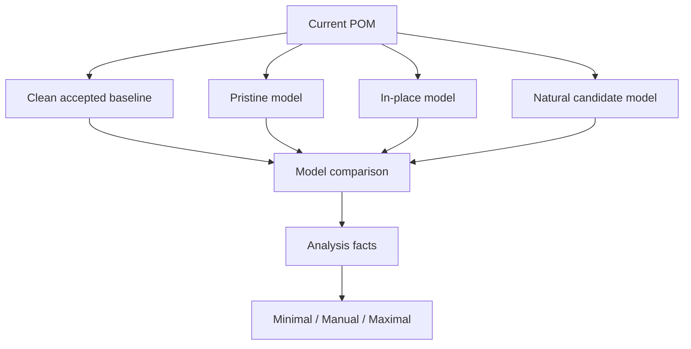
### Why four models?
The current `dependency:tree` alone is not enough.
If RedKite injected a `dependencyManagement` override, Maven will show the forced version, not the version that would naturally resolve from upstream dependencies.
Example:
```text
Original natural resolution:
library-a:1.0 -> transitive-x:2.4
RedKite injected override:
dependencyManagement forces transitive-x:2.6
Candidate natural resolution after upgrading library-a:
library-a:1.1 -> transitive-x:2.7
```
RedKite must be able to detect that the override is no longer needed.
---
## 5. RedKite Pins
RedKite-generated edits should be marked with a pin comment while they remain RedKite-managed.
```xml
<properties>
    <!-- redkite:pin action=modified control=property originalValue=2.15.4 recommendationId=rk-rec-123 -->
    <com.fasterxml.jackson.core.version>2.17.3</com.fasterxml.jackson.core.version>
</properties>
```
| Pin state | Meaning |
|---|---|
| Pin present | RedKite-managed/unaccepted change. |
| Pin removed | User accepted the change into the project baseline. |
| Origin known as RedKite-created | May still be removed in pristine/natural models to test whether it is still needed. |
The pin should record:
```text
action: modified | injected | normalized | manual-alignment
control type: property | dependencyManagement | pluginManagement | dependency | plugin | BOM
original value or original mapping
new value
affected artifacts
base fingerprint
recommendation/plan id
reason
```
---
## 6. Dependency Management Rules
RedKite must distinguish between **modified existing controls** and **injected controls**.
| Case | Clean accepted baseline behaviour |
|---|---|
| RedKite modified an existing property | Keep the property, restore/substitute the original value. |
| RedKite modified an existing dependencyManagement entry | Keep the entry, restore/substitute the original version. |
| RedKite modified an existing BOM | Keep the BOM, restore/substitute the original version. |
| RedKite injected a new dependencyManagement transitive override | Remove it from clean/natural models so Maven can resolve naturally. |
| User accepted RedKite change by removing pin | Keep it in accepted baseline, but remember RedKite origin locally. |
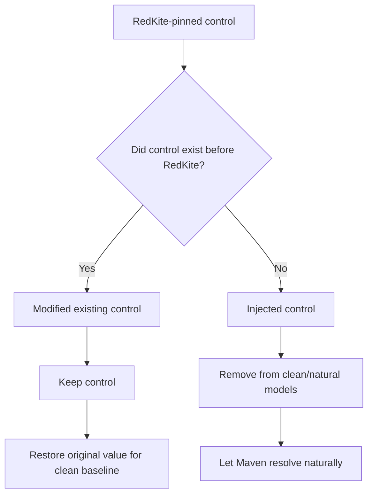
RedKite restores **declared controls**, not dependency-tree accidents.
A resolved transitive version is an outcome of one dependency graph, not automatically a rollback target.
---
## 7. Maven Normalization
On every analysis pass, RedKite should inspect Maven version structure.
It should recommend:
```text
direct versions -> properties
same groupId + same resolved version -> shared groupId-derived property
same groupId + different resolved versions -> keep separate properties
```
Example:
```text
Same groupId + same version:
  jackson.core.version = 2.15.4
  jackson.databind.version = 2.15.4
Normalize to:
  com.fasterxml.jackson.core.version = 2.15.4
```
But:
```text
Same groupId + different versions:
  mango4j.crypto.version = 1.8.2
  mango4j.collections.version = 3.1.0
Keep separate.
```
RedKite should not contain a hardcoded dependency-family database.
Alignment should come from Maven/project evidence:
```text
shared property
BOM
dependencyManagement
same-group same-version normalization
validated historical co-movement
```
---
## 8. Unmodified Baseline Validation
As part of analysis, RedKite must validate the current POM exactly as it exists on disk.
This is the **unmodified baseline**.
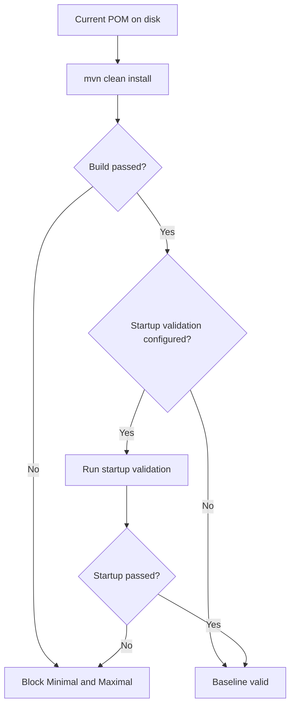
Validation may include:
```text
mvn clean install
mvn spring-boot:run
custom startup command
smoke tests
health checks
profile-specific validation
```
Virtual models are for comparison and planning only. They are not substitutes for proving the current repository builds.
If validation fails:
```text
Unmodified baseline validation failed.
The current project does not build/start successfully before RedKite changes anything.
Minimal and Maximal are blocked by default.
Manual may continue only as an explicit lower-confidence override.
```
---
## 9. Analysis Phase
Analysis produces facts and strategy choices. It does not select a path.
Analysis should report:
```text
current in-place dependency fingerprint
unmodified build/startup validation result
CVEs
outdated same-major candidates
direct versions
normalization opportunities
RedKite pins
RedKite injected overrides
accepted RedKite-origin controls
redundant overrides
known-good / known-bad local states
available strategies
```
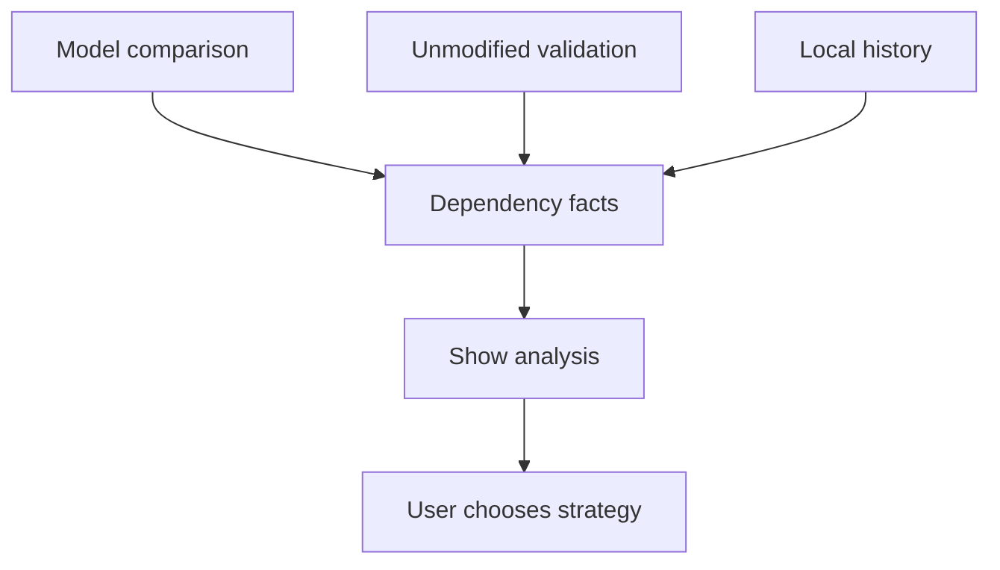
---
## 10. Strategies
After analysis, the user chooses one of three strategies.
| Strategy | Behaviour | Major-version rule |
|---|---|---|
| **Minimal Upgrade** | Smallest safe movement to fix/reduce CVEs or policy issues. | Same major only. |
| **Manual** | User chooses exact versions and controls. | May cross major with warning. |
| **Maximal** | Highest working same-major path. | Same major only. |
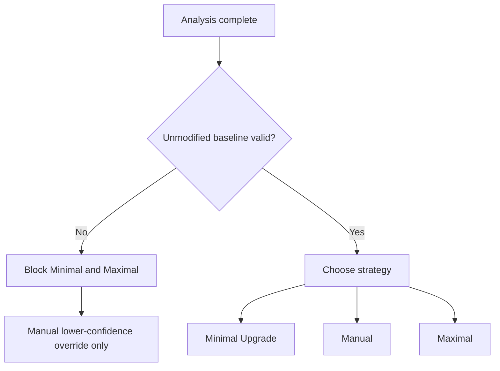
---
## 11. Minimal Upgrade
Minimal Upgrade is conservative.
It should:
```text
process CVEs first
stay within same major
choose nearest version that fixes/reduces issue
prefer properties/BOMs/dependencyManagement/pluginManagement
prefer upstream natural fixes over transitive pins
retire RedKite overrides only when natural model + validation prove safe
validate before marking known-good
```
Minimal does not chase latest.
---
## 12. Manual
Manual gives explicit user control.
It supports:
```text
exact versions
property changes
BOM changes
dependencyManagement changes
plugin changes
transitive overrides
major-version upgrades
partial/non-aligned changes
rollback targets
```
Manual must warn for:
```text
major-version jumps
newer-than-minimal choices
non-aligned choices
partial overrides
failed unmodified baseline
likely source-code remediation
versions previously known-bad
```
Manual choices are recorded as explicit user decisions and still require validation.
---
## 13. Maximal
Maximal tries to find the highest working same-major path.
It runs in two phases.
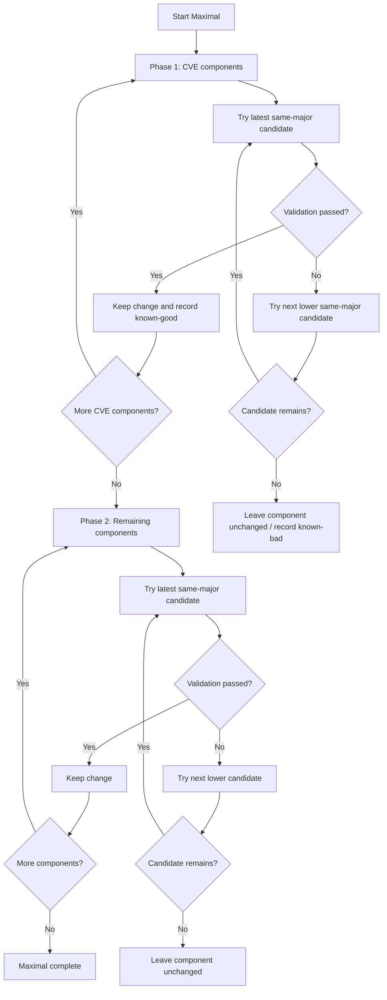
Rules:
```text
same major only
CVE components first
then remaining components
latest-down candidate search
validate one component/control group at a time
keep successes
rollback failures
stop at guardrails
```
---
## 14. Plan Generation
A plan is generated only after strategy selection.
A plan should include:
```text
strategy name
base fingerprint/model
unmodified validation result
controls to change
candidate and fallback versions
same-major/manual-major status
RedKite overrides to keep/remove/retire
validation pipeline
rollback target
warnings
guardrails
```
---
## 15. Execution and Validation
The scanner applies plans locally.
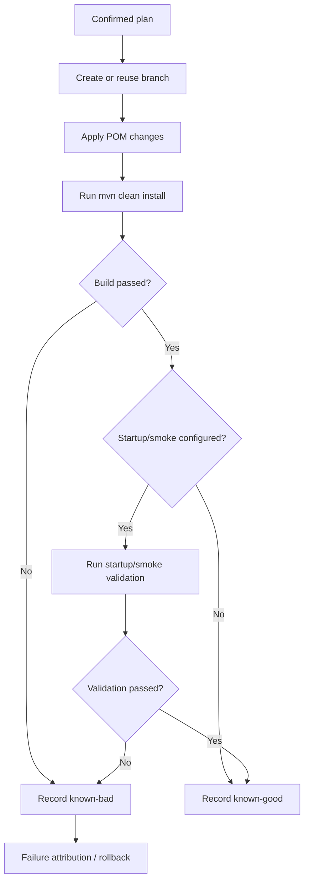
Typical validation:
| Type | Command |
|---|---|
| Build | `mvn clean install` |
| Spring Boot startup | `mvn spring-boot:run` |
| Smoke test | `mvn verify -Psmoke` or configured command |
---
## 16. Failure Attribution
On failure, RedKite compares what changed with where the failure points.
Evidence:
```text
dependency/control diff
Maven resolution errors
compiler errors
missing symbols
runtime linkage errors
startup root cause
failed tests/modules
dependency-tree-derived package/artifact mapping
previous baseline failure signatures
```
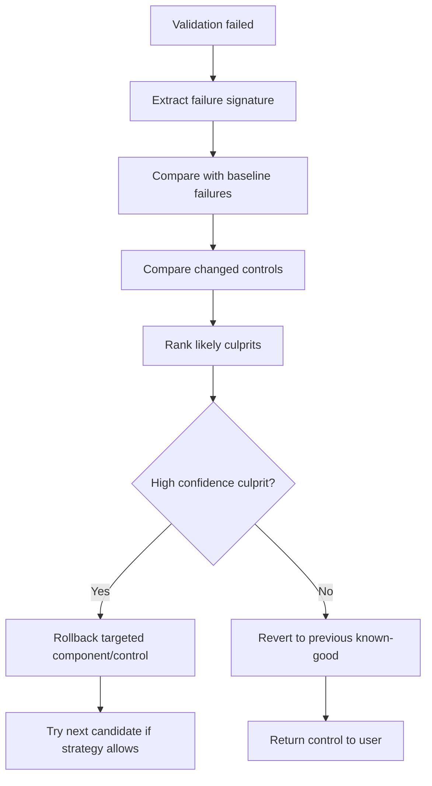
---
## 17. Auto-Loop Guardrails
Automatic retry loops must be bounded.
Required guards:
```text
max total attempts
max attempts per component
max elapsed time
max validation time
stop on repeated failure signature
no major upgrade outside Manual
revert to known-good on stop unless user opts out
```
Example:
```toml
[auto_remediation]
enabled = true
max_attempts = 5
max_attempts_per_component = 3
max_elapsed_minutes = 30
max_validation_minutes = 8
max_same_failure_repeats = 2
allow_major_upgrade = false
revert_to_known_good_on_stop = true
```
---
## 18. Single Page App Flow
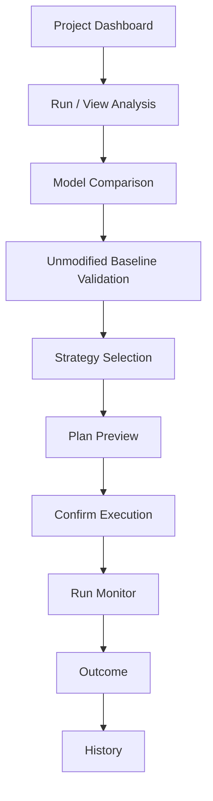
Main panels:
| Panel | Purpose |
|---|---|
| Project Dashboard | Project, branch, baseline status, CVEs, pins, normalization. |
| Model Comparison | Pristine vs clean accepted vs in-place vs natural/candidate. |
| Unmodified Validation | Current POM build/startup status. |
| Strategy Selector | Minimal, Manual, Maximal. |
| Plan Preview | Exact changes, fallbacks, warnings. |
| Run Monitor | Live validation progress. |
| History | Known-good/bad states, attempts, failures, accepted RedKite controls. |
---
## 19. Staged Development Plan
| Stage | Scope | Outcome |
|---|---|---|
| 1. Scanner and Local Analysis | Resolve effective POM/tree; detect versions, properties, BOMs, plugins, CVEs; compute fingerprints. | Analysis facts visible. |
| 2. Maven Normalization | Property conversion and same-group same-version consolidation with pins. | POMs become property-managed. |
| 3. Four-Model Comparison | Pristine, clean accepted, in-place, natural/candidate models. | RedKite influence and natural resolution are visible. |
| 4. Unmodified Baseline Validation | Validate current POM on disk with build/startup checks. | Starting point is proven. |
| 5. Strategy and Plan Generation | Minimal, Manual, Maximal; same-major enforcement; manual warnings. | User chooses intent and gets plan. |
| 6. Execution and Validation | Apply plans on branches; run validation; record history. | Known-good/bad local states. |
| 7. Failure Attribution | Suspect ranking, targeted rollback, next-lower retry. | Failures become actionable. |
| 8. Maximal Guardrails | Bounded latest-down same-major loops. | Safe maximal search. |
| 9. SPA Polish | Dashboard, model comparison, validation, strategies, warnings, logs, history. | End-to-end workflow. |
---
## 20. Final Principle
RedKite Assist should provide a controlled, auditable, rollback-safe dependency remediation workflow.
Automated strategies stay inside same-major boundaries.
Manual gives power users explicit control when they want to go further.